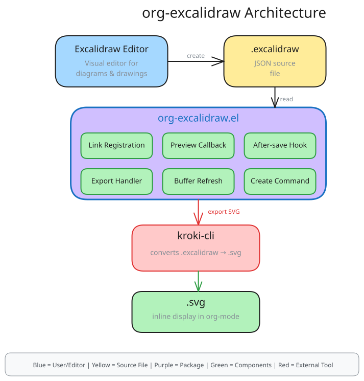

#+TITLE: org-excalidraw
#+DESCRIPTION: Display Excalidraw drawings inline in org-mode buffers via SVG rendering

* org-excalidraw

  Display [[https://excalidraw.com][Excalidraw]] drawings inline in ~org-mode~ buffers via SVG rendering.

  Edit diagrams in [[https://excalidraw.com][excalidraw.com]] or the desktop app, preview them directly in your org buffers, and export to HTML/LaTeX seamlessly.

* Features

  - Inline SVG preview of ~.excalidraw~ files in org-mode
  - Create new drawings with ~M-x org-excalidraw-create~
  - HTML and LaTeX export support
  - Works with [[https://excalidraw.com][excalidraw.com]] and the desktop app

* Requirements

  - Emacs 31+ (native SVG support via librsvg)
  - [[https://github.com/yuzutech/kroki-cli][kroki-cli]] on ~$PATH~ (converts ~.excalidraw~ -> ~.svg~)

* Installation

** Manual

   Clone this repo into your Emacs load path:

   #+begin_src shell
   git clone https://github.com/devbins/org-excalidraw ~/.emacs.d/site-lisp/org-excalidraw
   #+end_src

   Add to your init file:

   #+begin_src emacs-lisp
   (add-to-list 'load-path "~/.emacs.d/site-lisp/org-excalidraw")
   (require 'org-excalidraw)
   #+end_src

** use-package

   #+begin_src emacs-lisp
   (use-package org-excalidraw
     :load-path "~/.emacs.d/site-lisp/org-excalidraw")
   #+end_src

* Usage

** Creating drawings

   Run ~M-x org-excalidraw-create~. You'll be prompted for a filename; a ~.excalidraw~ file is created and an ~[[excalidraw:]]~ link is inserted at point.

** Link syntax

   In any org buffer, use the ~excalidraw:~ link type:

   #+begin_example
   [[excalidraw:my-diagram.excalidraw]]
   #+end_example

   The SVG image is rendered inline when you run ~M-x org-toggle-inline-images~ (or ~C-c C-x C-v~).

** Interactive commands

   | Command                        | Description                                     |
   |--------------------------------+-------------------------------------------------|
   | ~M-x org-excalidraw-create~      | Create a new ~.excalidraw~ file and insert link   |
   | ~M-x org-excalidraw-refresh~     | Refresh SVG for the link at point               |
   | ~M-x org-excalidraw-refresh-all~ | Refresh all ~excalidraw:~ links in current buffer |
   | ~C-c C-o~ (on link)              | Open ~.excalidraw~ file in system editor          |

* Customization

  All options live in the ~org-excalidraw~ customization group (~M-x customize-group org-excalidraw~).

  | Variable                            | Default | Description                                       |
  |-------------------------------------+---------+---------------------------------------------------|
  | ~org-excalidraw-converter-executable~ | ~kroki~   | Path to the converter executable (e.g. kroki-cli) |
  | ~org-excalidraw-default-width~        | ~600~     | Default display width in pixels                   |

* Architecture
  [[excalidraw:architecture.excalidraw]]
   

  The diagram above shows the package architecture:

  1. *User Layer*: Excalidraw editor creates/edits ~.excalidraw~ JSON files
  2. *Package Layer*: ~org-excalidraw.el~ handles link registration, SVG preview, and export
  3. *External Tool*: ~kroki-cli~ converts ~.excalidraw~ -> ~.svg~
  4. *Output*: ~.svg~ for inline display in org-mode

* Thanks

  - [[https://github.com/wdavew/org-excalidraw][wdavew/org-excalidraw]]

* License

  GPL-3.0-or-later
